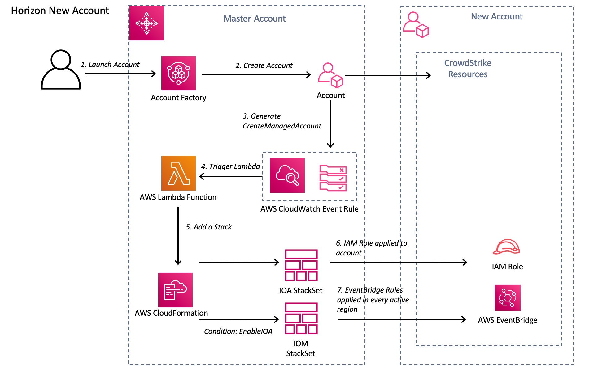

# Implementation Guide 

- [Implementation Guide](#implementation-guide)
  * [CrowdStrike Cloud Security Posture (Horizon) with AWS Control Tower](#crowdstrike-cloud-security-posture--horizon--with-aws-control-tower)
- [Foreword](#foreword)
- [Introduction](#introduction)
- [Pre-requisites](#pre-requisites)
- [Deployment Configuration Steps](#deployment-configuration-steps)
  * [Setup](#setup)
  * [Testing](#testing)
- [Additional Resources](#additional-resources)
- [CrowdStrike Resources](#crowdstrike-resources)
- [CrowdStrike Contact Information](#crowdstrike-contact-information)
## CrowdStrike Cloud Security Posture (Horizon) with AWS Control Tower

# Foreword
Horizon connects to your Public cloud accounts, assesses your cloud settings, and analyzes the findings to identify potential misconfigurations that can lead to security risks.

Horizon assesses your cloud configurations continuously and compares your settings to its policies. Using the information from those assessments, Horizon produces a cloud security posture-based dashboard and reports.

# Introduction

The diagram below shows the processes involved in registering an AWS account with CrowdStrike Horizon during the initial account creation process.

Figure 1: CrowdStrike Horizon Account Registration Architecture Diagram

The account creation process consists of the following steps

1) The Customer creates a new account through one of three methods

    https://docs.aws.amazon.com/controltower/latest/userguide/account-factory.html
    
    * Through the Account Factory console that is part of AWS Service Catalog.

    * Through the 'Enroll' account feature within AWS Control Tower.

    * From the AWS Control Tower landing zone's management account, using Lambda code and appropriate IAM roles.
    

2) Account Factory begins the account creation process. 
   
    AWS Control Tower uses CloudFormation StackSets to set up resources in your accounts. Each stack set has StackInstances that correspond to multiple accounts, and to multiple AWS Regions per account.

  
3) The account creation process generates a  *CreateManagedAccount* event notification in CloudWatch. Reference the AWS documentation at https://docs.aws.amazon.com/controltower/latest/userguide/lifecycle-events.html#createmanaged-account.

4) A CloudWatch event rule triggers a Lambda function PushHorizonStackInstances(push_horizon_stackset_lambda.py).   

5) The Lambda function pushes a template containing and IAM role and a second template containing EventBridge rules in every active region if the parameter "EnableIOA" is set during setup.

6) Once the IAM Role is created the Horizon service will use this role to discover assets in the account.
    
    The IAM is setup with a trust policy that includes an externalID generated by the CrowdStrike account registration API.
   
    How to Use an External ID When Granting Access to Your AWS Resources to a Third Party:
    [https://docs.aws.amazon.com/IAM/latest/UserGuide/id_roles_create_for-user_externalid.html](https://docs.aws.amazon.com/IAM/latest/UserGuide/id_roles_create_for-user_externalid.html)

   Note: the ``externalid`` is a string of random characters generated by CrowdStrike and returned in the initial org registration process.  

Note: The role name and externalID CANNOT be modified.

# Pre-requisites
Customers will require the following:
* Subscription to Falcon Horizon **or** the Falcon Cloud Workload Protection Bundle.

If you are new to AWS, see Getting Started with AWS:
[https://aws.amazon.com/getting-started/](https://aws.amazon.com/getting-started/)

For additional information on AWS Marketplace:
[https://aws.amazon.com/marketplace/help/about-us?ref_=footer_nav_about_aws_marketplace](https://aws.amazon.com/marketplace/help/about-us?ref_=footer_nav_about_aws_marketplace)

To get started with AWS Control Tower, review the User Guide:
[https://docs.aws.amazon.com/controltower/latest/userguide/getting-started-with-control-tower.html](https://docs.aws.amazon.com/controltower/latest/userguide/getting-started-with-control-tower.html)

# Deployment Configuration Steps

## Setup
Perform the tasks below to enable Control Tower to automatically register your account with CrowdStrike CSPM (Horizon).

1) Generate CrowdStrike Falcon API Keys.

    First login to the CrowdStrike console and go to [Support --> API Clients and Keys](https://falcon.crowdstrike.com/cloud-security/registration/en-US/app/cspm/cspm_accounts). Obtain CrowdStrike OAuth2 keys from the Falcon Console. Copy the ``CLIENT ID`` and ``SECRET`` as these will be used in the template.
   
    
   
    
2) Download the code from [https://github.com/CrowdStrike/Cloud-AWS](https://github.com/CrowdStrike/Cloud-AWS).

    The GitHub repository contains a folder "Control-Tower-horizon":

    * Select the template "Falcon_Horizon_Control_Tower.yaml" from the Control-Tower-For-Horizon "cloudformation" folder.

3) Load the CloudFormation template in the 'master' account

   Login to your Control Tower ``master`` account and apply the CloudFormation template "*Falcon_Horizon_Control_Tower.yaml*".

    Fill in the missing parameter values

   

   Parameters that should be provided by the customer:

   | Parameter Name            | Parameter Description                                                                                       | 
|---------------------------|:------------------------------------------------------------------------------------------------------------|
   | 
| CSCloud                   | The CrowdStrike Cloud your CID is hosted in                                                                 |
   | FalconClientId            | Your Falcon OAuth2 API Key from the CrowdStrike Console                                                     |
   | FalconSecret              | Your Falcon OAuth2 API Secret from the CrowdStrike Console                                                  |
| EnableIOA                 | Select true to enable IOA scanning (Sets up eventbridge forwarding rules                                    |
| UseExistingCloudtrail     | Select if you have an existing org wide cloudtrail or you do not want to process Get, List, Describe events |
| PushMasterAccountStackset | Select if you wish to automatically apply the master account stackset                                       |

   The CloudFormation template will create the following resources in the account:

**CrowdStrike-CSPM-Integration** -- Stackset that defines the IAM role that should always be applied to all accounts that require monitoring *(Apply to a single region in each account)*

**Below StackSets that should be applied if EnableIOA is selected**

**1) CrowdStrike-CSPM-Integration-EB** -- Stackset that defines EventBridge rules that should be applied to all regions in all member accounts that require monitoring *(Apply to all active regions in each account)*

**2) CrowdStrike-CSPM-Integration-Root-EB** -- Stackset that defines EventBridge rules that should be applied to all regions in the **Master** account
 *(Apply to all active regions in the account)*

Note

## Testing 

Create or Enroll an account in to AWS Control Tower using account factory:

Once the account has been created (usually takes around 30 minutes), check the status of the account:

Go to CloudFormation -> StackSets and verify the stack instances exists:

Login to the new account and check that the StackSet has been applied.

Verify that the IAM role has been configured in the new account:

Check the Account Status in the CrowdStrike Console

Login to the CrowdStrike console and check the account status. Navigate to ``Cloud Security --> Cloud Accounts Registration``. The screen below will show the accounts that have been added:

Accounts and resources will begin to appear in the dashboard:

# Additional Resources
ID When Granting Access to Your AWS Resources to a Third Party:
* [https://docs.aws.amazon.com/IAM/latest/UserGuide/id_roles_create_for-user_externalid.html](https://docs.aws.amazon.com/IAM/latest/UserGuide/id_roles_create_for-user_externalid.html)

If you are new to AWS, see Getting Started with AWS:
* [https://aws.amazon.com/getting-started/](https://aws.amazon.com/getting-started/)

For additional information on AWS Marketplace:
* [https://aws.amazon.com/marketplace/help/about-us?ref_=footer_nav_about_aws_marketplace](https://aws.amazon.com/marketplace/help/about-us?ref_=footer_nav_about_aws_marketplace)

To get started with AWS Control Tower:
* [https://docs.aws.amazon.com/controltower/latest/userguide/getting-started-with-control-tower.html](https://docs.aws.amazon.com/controltower/latest/userguide/getting-started-with-control-tower.html)

# CrowdStrike Resources
To learn more about CrowdStrike:
* [CrowdStrike on Amazon Partner Network (APN)](https://aws.amazon.com/partners/find/partnerdetails/?n=CrowdStrike&id=001E000001VAPbPIAX)
* [CrowdStrike website](http://crowdstrike.com/)

To review CrowdStrike AWS Marketplace Listings:
* [CrowdStrike AWS Marketplace Listings](https://aws.amazon.com/marketplace/seller-profile?id=f4fb055a-5333-4b6e-8d8b-a4143ad7f6c7)

To learn more about Falcon Cloud Workload Protection product:
* [CrowdStrike Falcon Cloud Workload Protection Website](https://www.crowdstrike.com/cloud-security-products/falcon-cloud-workload-protection/)
* [CrowdStrike Falcon Cloud Workload Protection Data sheet](https://www.crowdstrike.com/resources/data-sheets/falcon-cloud-workload-protection/)

# CrowdStrike Contact Information
For questions regarding CrowdStrike offerings on AWS Marketplace or service integrations: [aws@crowdstrike.com](aws@crowdstrike.com)

For questions around product sales: [sales@crowdstrike.com](sales@crowdstrike.com)

For questions around support: [support@crowdstrike.com](support@crowdstrike.com)

For additional information and contact details: [https://www.crowdstrike.com/contact-us/](https://www.crowdstrike.com/contact-us/)
